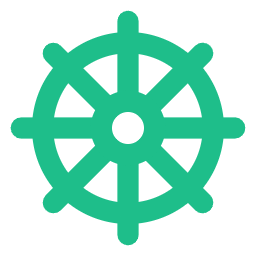

<div align="center">
  

  # DrKate

  DrKate is a disaster recovery tool for Kubernetes. It copies namespaced resources from a source cluster, stores them locally as encrypted YAML, and lets you review, edit, and deploy them to a DR cluster from a web UI.

</div>

## How it works

1. Point DrKate at a **source** cluster and a **DR** cluster with kubeconfig files.
2. DrKate scrapes namespaced resources from the source (on a schedule or when you click scrape).
3. Cluster noise is stripped before storage: status, UIDs, resource versions, and similar fields.
4. Manifests are stored encrypted on disk.
5. The UI compares what you stored against the DR cluster, so you can see what is synced, drifted, or missing.
6. Operators can deploy missing or drifted resources, or a single resource after editing it.

DrKate does not take over either cluster. It reads from source, writes to local storage, and only creates or updates objects on DR when you deploy.

## Install

Releases are a single Linux amd64 binary (the web UI is already inside it).

1. Download the latest `drkate_*_linux_amd64.tar.gz` from [GitHub Releases](https://github.com/jamie/drkate/releases/latest).
2. Unpack it:

```bash
tar -xzf drkate_*_linux_amd64.tar.gz
```

## Configure

Copy the example config next to the binary:

```bash
cp config.example.yaml config.yaml
```

You need:

- A kubeconfig for the **source** cluster
- A kubeconfig for the **DR** cluster
- Two secrets: a session secret (cookies) and an encryption key (stored manifests)

Generate the secrets:

```bash
openssl rand -hex 32
```

Put them in `config.yaml`:

```yaml
server:
  listen: ":8080"
  session_secret: "<64 hex characters>"

storage:
  path: ./data
  encryption_key: "<64 hex characters>"

source:
  kubeconfig: /path/to/source.kubeconfig
  namespaces:
    all: true
    exclude: ["kube-system", "kube-public", "kube-node-lease"]

dr:
  kubeconfig: /path/to/dr.kubeconfig

scrape:
  interval: 15m
```

If you would rather not put secrets in the file, set `session_secret_env` and `encryption_key_env` to environment variable names instead. See [config.example.yaml](config.example.yaml).

### Which namespaces to scrape

Pick one mode:

- **Include:** only the namespaces you list
- **Exclude:** every namespace except the ones you list
- **All:** every namespace, optionally with an exclude list

System namespaces (`kube-system`, `kube-public`, `kube-node-lease`) are excluded by default unless you turn that off.

## First start

On first run there are no users yet. Set a bootstrap admin password, then start DrKate:

```bash
export DRKATE_BOOTSTRAP_PASSWORD=your-admin-password
./drkate --config config.yaml
```

Open http://localhost:8080 and sign in as `admin` with that password. Change it after you log in, and add other users from the Users page.

`DRKATE_BOOTSTRAP_PASSWORD` is only used when the user store is empty. Keep the process running somewhere that can reach both clusters (a Linux host with the kubeconfig files is the usual setup).

## Using DrKate

- **Overview** shows each scraped namespace and how it compares to DR.
- **Scrape source** pulls a fresh copy from the source cluster. Scrapes also run on the interval in config.
- Open a namespace to see each resource as synced, drifted, or missing.
- **Deploy missing**, **Deploy drifted**, or **Deploy all** applies stored manifests to the DR cluster.
- Open a resource to edit YAML, save it locally, and deploy that one object.

Roles:

| Role     | Can do                                      |
| -------- | ------------------------------------------- |
| Viewer   | See status and manifests                    |
| Operator | Scrape, edit, and deploy                    |
| Admin    | Everything operators can do, plus user admin |

## Configuration notes

Full options live in [config.example.yaml](config.example.yaml). The ones operators usually change:

| Setting | Purpose |
| ------- | ------- |
| `server.listen` | Address and port for the web UI (default `:8080`) |
| `storage.path` | Where encrypted manifests and users are stored |
| `source.namespaces` | Which namespaces to scrape |
| `scrape.interval` | How often to scrape automatically (`15m`, `1h`, or empty to disable) |
| `scrape.exclude_kinds` | Extra resource kinds to skip |
| `scrape.exclude_names` | Extra resource names to skip (by kind) |
| `scrape.preserve_replicas` | Keep replica counts from the source (default true) |
| `scrape.preserve_helm_annotations` | Keep Helm metadata on scraped objects |

Pods, ReplicaSets, Endpoints, EndpointSlices, PodMetrics, Leases, the `kube-root-ca.crt` ConfigMap, and the `default` ServiceAccount are skipped automatically.

Treat `config.yaml`, kubeconfig files, and the `data/` directory as secrets. They are not meant to be committed or shared.

## Building from source

You only need this if you are not using a release binary. Requires Go (see `go.mod`) and Node.js 20+.

```bash
./build.sh
./drkate --config config.yaml
```
